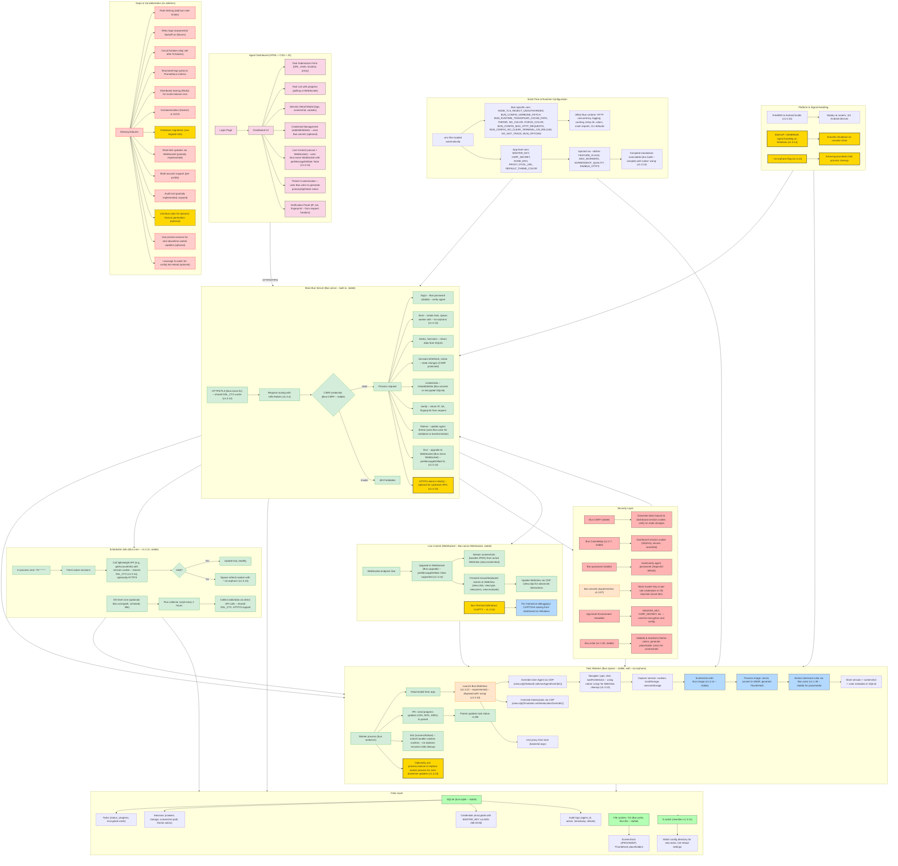

# Final Architecture – Bun Automation Platform (v1.3.14+)

This is the **complete, unified blueprint** for a production-grade automation platform, now enhanced with the latest Bun v1.3.14 features. It goes beyond simple scraping – it is a **next-generation system tool** that can:

- Orchestrate thousands of headless browsers with zero memory leaks.
- Communicate with modern HTTP/3 backends and TLS-encrypted databases with minimal overhead.
- Watch file systems for configuration changes and react instantly.
- Spawn child processes with **kernel-guaranteed cleanup** (`--no-orphans`).
- Replace its own process image for zero-downtime updates (`process.execve`).
- Run on **Linux, macOS, Windows, FreeBSD, and Android**.
- Provide a cross-platform terminal UI (ConPTY) for interactive debugging.
- Manage resources cleanly with native `using` / `await using`.

All of this is built on Bun's native APIs – no external dependencies, compiled into a single executable.

---

## 1. What the Latest Release (v1.3.14) Unlocks

| Feature | What It Enables |
|---------|-----------------|
| **HTTP/3 (QUIC) client in `fetch()`** | Blazing-fast, low-latency connections to modern APIs (Google, Cloudflare, etc.). Multiplexing without head-of-line blocking – ideal for fetching many small assets concurrently. |
| **Shared SSL_CTX cache** | TLS connections (Postgres, MongoDB, HTTPS, WebSockets) reuse the same SSL context – memory usage drops from ~1 GB to ~168 MB for 1000 connections. Critical for high-throughput connection pools. |
| **Rewritten `fs.watch`** | Now recursively watches new subdirectories, handles file re-creation after deletion, and uses a single thread on macOS – perfect for building file-sync tools, hot-reloaders, and log tailers. |
| **`--no-orphans` CLI flag** | Uses Linux `prctl` to kill child processes the instant the parent dies (even after `SIGKILL`). No more zombie processes in CI/CD or long-running jobs. |
| **`process.execve()`** | Replace the current process image – ideal for "launcher" scripts that set up environment then hand off to the real binary, achieving zero-overhead process replacement. |
| **`Bun.Terminal` on Windows (ConPTY)** | Full PTY support for `cmd.exe`, PowerShell, and any console app on Windows – enables interactive TUI dashboards, SSH clients, and container shells that work cross-platform. |
| **Native `using` / `await using`** | Automatic resource disposal (WebViews, DB connections, file handles) without transpilation overhead – cleaner, faster, and stack-trace friendly. |
| **FreeBSD & Android builds** | Deploy Bun on routers (pfSense, TrueNAS), IoT devices, and Android phones – extending automation to edge computing. |
| **WebSocket `perMessageDeflate: false`** | Reliably connect to enterprise WebSocket gateways that reject compression extensions – essential for corporate environments. |
| **SIGHUP / SIGBREAK on Windows** | Gracefully shut down on console close – prevents data corruption in long-running services. |

---

## 2. Updated Architecture Diagram (v1.3.14+)

---

## 3. How the New Features Fill Gaps

| Gap | How Bun v1.3.14 Helps |
|-----|-----------------------|
| **High memory usage for TLS connections** | Shared SSL_CTX cache drastically reduces RSS (from ~1 GB to ~168 MB for 1000 connections). |
| **Slow HTTP/1.1 connections to modern APIs** | HTTP/3 (QUIC) client in `fetch()` provides faster, multiplexed connections. |
| **Zombie processes in workers** | `--no-orphans` ensures child processes are killed by the kernel when the parent dies. |
| **No file-system watching for config changes** | Rewritten `fs.watch` now recursively catches new subdirectories and handles file re-creation – enabling hot-reload of task definitions. |
| **No graceful shutdown on Windows console close** | `SIGHUP` / `SIGBREAK` support allows cleanup on window close. |
| **Resource leaks from missing disposals** | Native `using` / `await using` makes resource cleanup automatic and efficient. |
| **WebSocket handshake failures with proxies** | `perMessageDeflate: false` ensures compatibility with enterprise gateways. |
| **Limited OS support** | FreeBSD and Android builds extend deployment to edge devices and routers. |
| **Zero-downtime updates** | `process.execve()` allows replacing worker processes without restarting the server. |

---

## 4. Version Reference (All APIs)

| API / Feature | Bun Version | Stability | Role |
|---------------|-------------|-----------|------|
| `Bun.serve` (HTTP, TLS, WebSocket) | Built-in | Stable | Main server |
| `Bun.WebView` | v1.3.12 | Experimental | Headless browser automation |
| `Bun.Image` | v1.3.14 | Stable | Image processing |
| `Bun.cron` (in-process) | v1.3.11 | Stable | Scheduling |
| `Bun.cron` (OS-level) | v1.3.11 | Stable | System cron jobs |
| `Bun.spawn` (IPC, `--no-orphans`) | Built-in (v1.3.14 flag) | Stable | Worker processes |
| `process.execve()` | v1.3.14 | Stable | Process replacement |
| `Bun.password` | Built-in | Stable | Authentication |
| `Bun.CSRF` | Built-in | Stable | CSRF protection |
| `Bun.CookieMap` | v1.2.7 | Stable | Cookie handling |
| `Bun.secrets` | Built-in | Experimental | OS keychain |
| `Bun.color` | v1.1.30 | Stable | Color utilities |
| `Bun.markdown` (`html`, `render`, `react`) | v1.3.8 | Unstable | Markdown parsing/rendering (GFM, autolinks, heading IDs, LaTeX math, wiki links) |
| `Bun.markdown.ansi()` + `bun ./file.md` CLI | v1.3.12 | Unstable | ANSI terminal output; `bun ./file.md` renders .md files directly |
| `Bun.env` / `process.env` | Built-in | Stable | Environment variables |
| `Bun.write` / `Bun.file` | Built-in | Stable | File/S3 operations |
| `bun:sqlite` | Built-in | Stable | SQLite database |
| `console` `%j` | v1.3.4 | Stable | JSON logging |
| `--define` | Built-in | Stable | Build-time constants |
| `bun build --compile` | Built-in | Stable | Standalone executables |
| HTTP/3 client in `fetch()` | v1.3.14 | Stable | Fast, multiplexed HTTP |
| Shared SSL_CTX cache | v1.3.14 | Stable | Low-memory TLS |
| Rewritten `fs.watch` | v1.3.14 | Stable | File system monitoring |
| `Bun.Terminal` (Windows ConPTY) | v1.3.14 | Stable | Cross-platform PTY |
| Native `using` / `await using` | v1.3.14 | Stable | Resource disposal |
| FreeBSD / Android builds | v1.3.14 | Stable | Broader OS support |
| `perMessageDeflate: false` | v1.3.14 | Stable | WebSocket compatibility |
| SIGHUP / SIGBREAK on Windows | v1.3.14 | Stable | Signal handling |

### `Bun.markdown` — Built-in Markdown Parser (v1.3.8 core, v1.3.12 ansi, Unstable)

Fast, CommonMark-compliant parser (Zig port of `md4c`). Four render modes:

| Function | Signature | Output | Version |
|----------|-----------|--------|---------|
| `Bun.markdown.html()` | `html(input, options?)` | HTML string | v1.3.8 |
| `Bun.markdown.render()` | `render(input, callbacks?, options?)` | Custom string (ANSI, HTML, plain text) | v1.3.8 |
| `Bun.markdown.react()` | `react(input, components?, options?)` | React JSX elements (Fragment) | v1.3.8 |
| `Bun.markdown.ansi()` | `ansi(input, theme?)` | ANSI-colored terminal string | v1.3.12 |

**CLI:** `bun ./file.md` (v1.3.12+) — renders .md files directly to terminal ANSI output, zero JS VM startup.

**v1.3.14 fix:** `ansi()` crash on invalid UTF-8 (lone continuation bytes `0x80-0xBF`, bytes `0xF8-0xFF`) — now treated as replacement characters.

**21 render callbacks** (14 block + 7 inline): `heading`, `paragraph`, `blockquote`, `code`, `list`, `listItem`, `hr`, `table`, `thead`, `tbody`, `tr`, `th`, `td`, `html` (block); `strong`, `emphasis`, `strikethrough`, `link`, `image`, `codespan`, `text` (inline).

**GFM extensions enabled by default:** `tables`, `strikethrough`, `tasklists`.

**Additional options (all default `false`):** `autolinks` (`boolean | { url, www, email }`), `headings` (`boolean | { ids, autolink }`), `hardSoftBreaks`, `wikiLinks`, `underline`, `latexMath`, `collapseWhitespace`, `permissiveAtxHeaders`, `noIndentedCodeBlocks`, `noHtmlBlocks`, `noHtmlSpans`, `tagFilter`.

**Meta interfaces** (passed to `render()` callbacks): `ListMeta` (`{ depth, ordered, start? }`), `ListItemMeta` (`{ index, depth, ordered, start?, checked? }`), `HeadingMeta` (`{ level, id? }`), `CodeBlockMeta` (`{ language? }`), `CellMeta` (`{ align? }`), `LinkMeta` (`{ href, title? }`), `ImageMeta` (`{ src, title? }`).

**AnsiTheme options:** `colors`, `columns`, `hyperlinks` (OSC 8), `kittyGraphics` (inline images), `light`.

**React:** `reactVersion?: 18 | 19` (default 19 = `react.transitional.element`; 18 = `react.element`).

**Docs:** [Markdown](https://bun.com/docs/runtime/markdown) (html/render/react only) · [Reference](https://bun.com/reference/bun/markdown) (all four) · [Blog v1.3.8](https://bun.com/blog/bun-v1.3.8) · [Blog v1.3.12](https://bun.com/blog/bun-v1.3.12) (ansi + CLI)

---

## 5. The Big Picture

With these capabilities, the platform evolves from a simple scraping tool into a **universal automation and system management engine**:

- **Developers** can use it as a **self-hosted CI/CD runner** – watch a Git repo, spawn builds, and replace the runner process on updates.
- **DevOps teams** can deploy it on **edge devices** (routers, Android phones) to monitor network health and trigger failovers.
- **Enterprises** can use it as a **secure API gateway** – HTTP/3 + TLS cache + WebSocket proxying all in one binary.
- **Individual users** can run it as a **personal automation assistant** – monitor a folder, scrape data, and send notifications.

All of this is built on Bun's native APIs, with zero external dependencies, compiled into a single, fast, and memory-efficient executable. The latest Bun release (v1.3.14) provides the missing pieces – reliable file watching, kernel-level child process cleanup, low-memory TLS, and cross-platform PTY – making this architecture truly production-ready.
